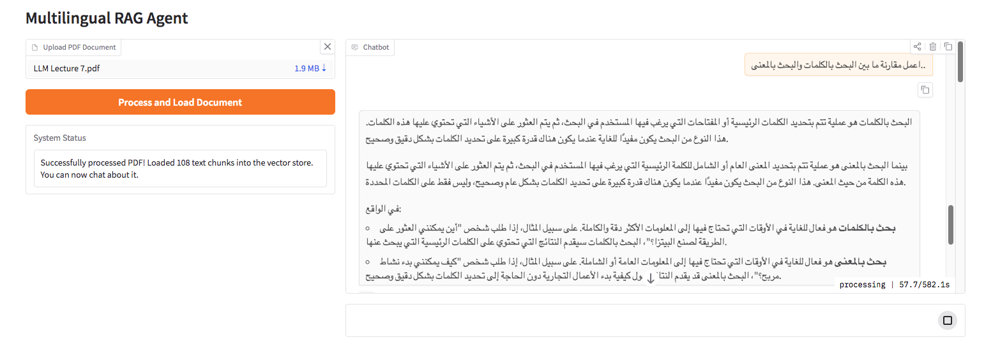
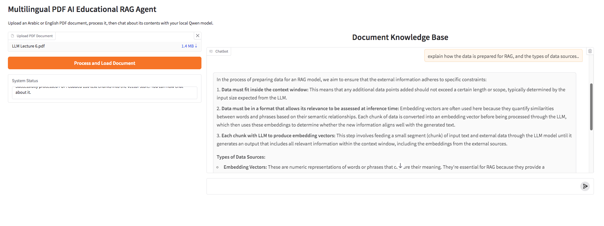
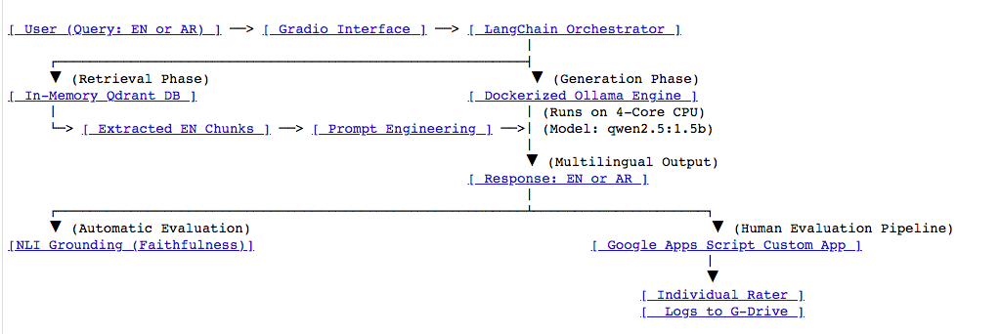
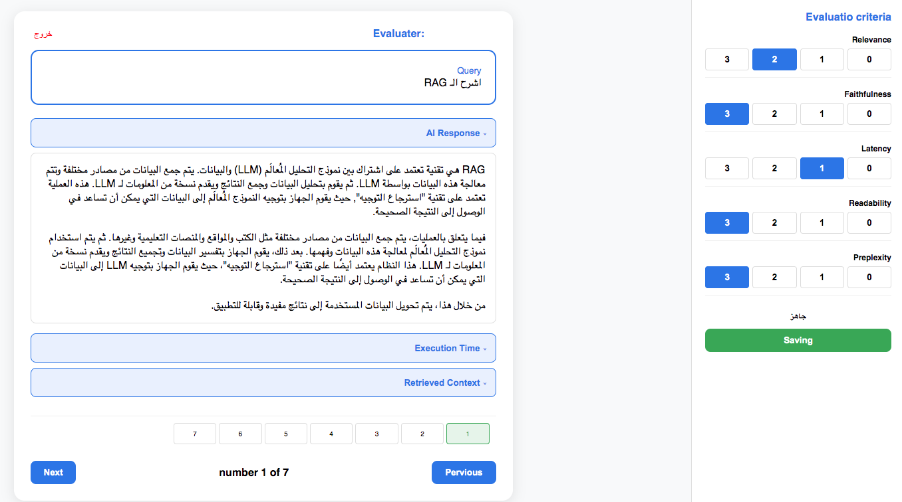

# Local Multilingual Educational RAG System

A lightweight, localized, and secure Retrieval-Augmented Generation (RAG) agent designed to act as an interactive teaching assistant. The system ingests English presentation slides (PDF/PPT format) and supports cross-lingual interaction, allowing students to query and receive responses in both English and Arabic. The architecture is engineered to run entirely on a 4-core consumer CPU.

   

# System Workflow Diagram

  

## Architecture & Technical Pipeline

### 1. Ingestion & Ephemeral Vector Storage
* **Advanced Document Parsing:** Utilized `fitz` (**PyMuPDF**) combined with **LangChain** to handle non-linear slide layouts. This approach extracts text locked inside floating text boxes, shapes, and complex diagrams that standard parsers misalign.
* **Hardware-Aware Chunking Strategy:** Implemented a tight **Chunk Size of 300 characters** with an **Overlap of 50 characters**. This compact context boundary ensures high token density and prevents memory thrashing during local CPU matrix calculations.
* **Lightweight Embeddings:** Generated vectors using the `granite-embedding` model via **Ollama**, ensuring high semantic mapping accuracy for educational content.
* **Session-Isolated Storage:** Configured an in-memory **Qdrant** database instance. Vector structures are instantiated dynamically per user session, providing strict privacy boundaries and zero persistent disk I/O overhead.

### 2. Cross-Lingual Orchestration & Local Inference
* **Dockerized Execution Environment:** Isolated the LLM infrastructure using a **Dockerized Ollama image**, standardizing environment dependencies and optimizing container-level CPU resource mapping.
* **CPU-Optimized Generation:** Selected the lightweight **qwen2.5:1.5b** model running locally. This 1.5B parameter profile provides rapid token generation on a 4-core CPU while retaining solid multilingual reasoning capabilities.
* **Cross-Lingual Capability:** Engineered system prompts using **LangChain Ollama** to allow cross-lingual retrieval. The model successfully processes incoming queries in either Arabic or English, searches the English vector index, synthesizes the context, and outputs its final pedagogical response in the student's preferred language.
* **User Interface:** Built a web interface using **Gradio**.

## Dual-Layer Evaluation Framework

To ensure maximum safety and pedagogical reliability without relying on cloud-based commercial APIs, the system utilizes a hybrid evaluation strategy:

### A. Automated Metric: Faithfulness (Groundedness)
Because this application operates without human-curated ground truth target answers, the system automates quality control using **Faithfulness** as its core standalone metric.
* **Mechanism:** An automated LLM-as-a-Judge inspects the **Generated Response** against the **Retrieved Context Chunks**.
* **Objective:** It verifies that every mathematical statement, definition, or factual claim in the final response is strictly derived from the English source PDF, mathematically penalizing any cross-lingual translation hallucinations or model fabrications.

### B. Human-in-the-Loop Infrastructure (Google Apps Script Engine)
To run a cost-effective user study, a custom evaluation infrastructure was built on top of the Google Workspace ecosystem:
* **Custom Evaluation Web App:** Built a lightweight web app using **Google Apps Script** to serve evaluation queues to human raters.
* **Multi-Criteria Scoring:** Human raters grade output pairs on a strict 0–3 scale across 5 dimensions: *Relevance, Faithfulness, Latency, Readability,* and *Perplexity*.
* **Automated Data Pipeline:** The Apps Script backend dynamically processes inputs, separates individual evaluator submissions, and saves structured log files directly into secured, isolated **Google Drive** folders for downstream statistical analysis (e.g., Inter-Annotator Agreement via Cohen's Kappa).

# Evaluation Web App

  

## Human Evaluation Results

To evaluate the quality of the outputs, we conducted a human evaluation pipeline across five core criteria: **Relevance, Faithfulness, Latency, Readability, and Perplexity**. Two independent annotators rated the dataset using an ordinal scale ranging from **0 to 3**.

### Inter-Annotator Agreement (IAA). Cohen's Kappa (Linear)

Since the rating scale is ordinal (0–3), where the distance between categories carries meaningful order, we utilized **Weighted Cohen's Kappa (Linear)** as our primary metric. Linear weighting accounts for near-misses (e.g., a disagreement between 2 and 3 is penalized less than between 0 and 3), providing a more realistic measurement of agreement than standard Kappa.

Below is the detailed breakdown of the agreement scores for each individual criterion alongside the overall global evaluation:

Criterion       | Weighted Kappa (Linear)
----------------------------------------
Relevance        |                 0.3232
Faithfulness     |                 0.4104
Latency          |                 0.1492
Readability      |                 0.6803
Preplexity       |                 0.4476

Overall Cohen's Kappa Score: 0.4752
Interpretation: Moderate Agreement.

*\*Guidelines for Interpretation:* < 0.20: Slight | 0.21–0.40: Fair | 0.41–0.60: Moderate | 0.61–0.80: Substantial | 0.81–1.00: Almost Perfect.

### Key Insights & Methodology Details
* **Granular Analysis:** Documenting the agreement per criterion allows us to identify which aspects of the evaluation were more objective (higher kappa) and which required more subjective interpretation from the raters (lower kappa).
* **Metric Choice:** Standard Cohen's Kappa treats ordinal ranks as nominal categories, which heavily penalizes minor subjective variances. The Linear Weighted Kappa adjusts for this, reflecting a robust global **Moderate Agreement** ($0.41 - 0.60$) between the raters.
* **Data Alignment:** All scores represent synchronized row-by-row annotations across both independent evaluation datasets.

